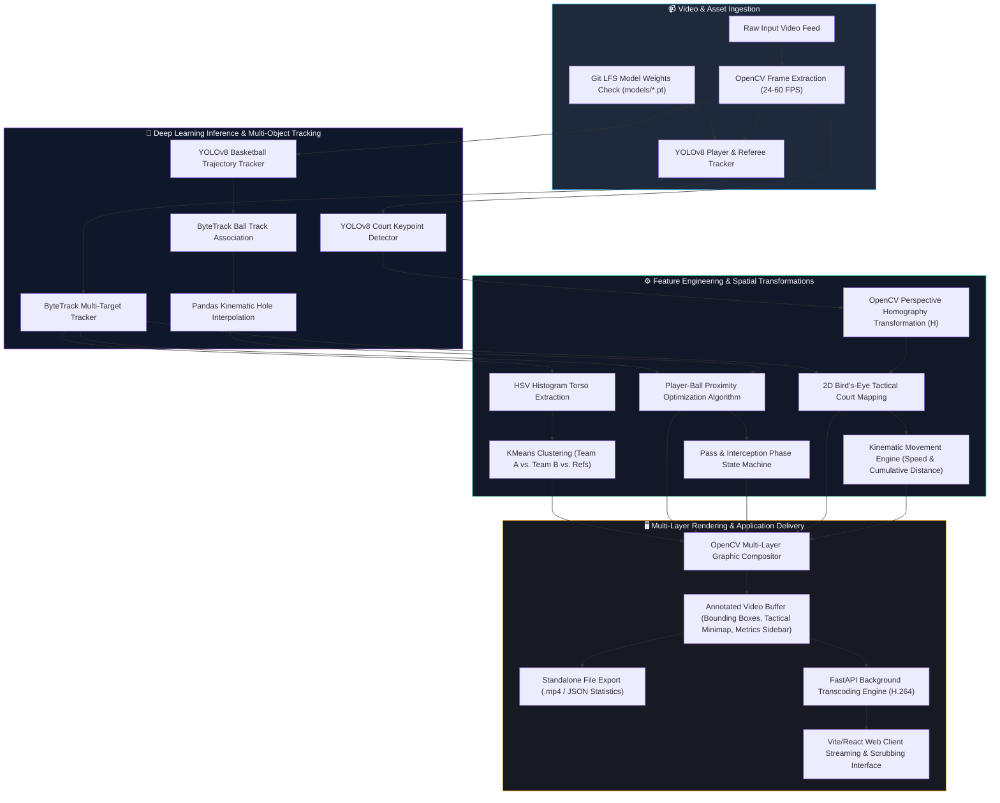

# CourtVision: Applied Machine Learning & Basketball Sports Analytics Pipeline

> **Pillar 2 of Software Engineering Portfolio** — *Applied Deep Learning, Real-Time Computer Vision Tracking, Spatial Homography Transformation, and Reactive Full-Stack Analytics.*

---

## 🏆 Executive Summary & Engineering Architecture

**CourtVision** is a comprehensive sports video analytics software suite designed to transform unstructured high-definition broadcast basketball footage into actionable tactical insights and quantitative metric summaries. Combining fine-tuned **YOLOv8 deep neural networks**, robust multi-object tracking (**ByteTrack**), unsupervised clustering, and spatial perspective homography transformations, the platform dynamically bridges raw 2D pixel coordinates with real-world physical court kinematics.

Designed for scalability and modular integration, CourtVision operates both as a **standalone CLI computational engine** for batched video processing and as a **reactive full-stack web service** powered by a high-performance **FastAPI** backend and an interactive **Vite / React** client interface.


*(Note: Upload your UI screenshot to the `assets/` folder and name it `dashboard_preview.png`)*

---

## 🚧 Work in Progress & Current Enhancements

While the core pipeline is fully functional, I am actively refining the downstream Python logic to achieve 100% precision:
* **Player Tracking & Roster:** Enhancing bounding-box tracking accuracy and out-of-bounds geometric polygon filtering (`cv2.pointPolygonTest`) to ensure the team roster UI binds cleanly without including the bench/crowd.
* **Score Tracking:** Honing the `pytesseract` OCR robustness to handle scoreboard graphic overlays across different broadcast networks and detect Scoring Events via polling.
* **Team Assignment (K-Means):** Continuing to refine HSV color space masking to dynamically ignore court reflections, warm wood tones, and dark shadows for flawless jersey clustering.
* **Tactical Minimap Extraction:** Rendering the birds-eye homography tactical view into a standalone H.264 video feed for the frontend UI.

---

## 🛠️ Core Technical Stack & Capabilities

| Component | Engineering Technology & Frameworks | Primary Function & Role |
| :--- | :--- | :--- |
| **Deep Learning & Inference** | **PyTorch**, **YOLOv8** (Ultralytics) | Object detection targeting basketball players, referees, game balls, and court landmark keypoints. |
| **Multi-Target Tracking** | **ByteTrack** (via Supervision) | Consistent across-frame tracking IDs and trajectory association in dynamic occlusion environments. |
| **Trajectory Interpolation** | **Pandas** (`bfill` / cubic interpolation) | Reconstructing sparse or motion-blurred basketball coordinates across multi-frame occlusions. |
| **Unsupervised ML & Classification** | **Scikit-Learn** (KMeans), **OpenCV HSV** | Jersey color feature extraction, saturation filtering, and unsupervised team vs. referee separation. |
| **Spatial Perspective Mapping** | **OpenCV Homography** (`warpPerspective`) | Projecting dynamic camera view coordinates onto a standardized 2D bird's-eye tactical court template. |
| **Kinematic Analytics Engine** | **NumPy**, Custom Mathematical Models | Frame-by-frame velocity ($km/h$ & $m/s$), total spatial distance ($ft/m$), and possession time allocation. |
| **Full-Stack Application Layer** | **FastAPI**, **Python Multi-threading**, **H.264 Transcode** | Non-blocking asynchronous video processing with resilient H.264 streaming fallbacks for web browsers. |
| **Interactive Client UI** | **Vite / React**, **TypeScript** | Real-time upload interface, interactive video scrubbing, and visual sports performance metrics. |

---

## 📐 System Architecture & End-to-End Data Pipeline

The following architectural flow demonstrates the end-to-end transformation of input video frame buffers through inference models, feature extraction layers, homography projection matrices, and multi-layer rendering engines:



---

## 🔬 Deep-Dive Architectural & Algorithm Features

### 1. Spatial Court Homography & Tactical Minimap Projection
Standard broadcast footage dynamically alters perspective angles, making Euclidean metric measurement directly in pixel space invalid. CourtVision resolves this by employing a **YOLOv8 Court Keypoint model** (`court_keypoint_detector.pt`) to locate fixed visual boundary landmarks (e.g., three-point arcs, free-throw paint corners, and centerline intersections). 

Using pairs of corresponding source pixel coordinates ($x_{src}, y_{src}$) and real-world geometric court templates ($x_{dst}, y_{dst}$ in standard feet/meters), an **OpenCV homography transformation matrix $H$** is evaluated per frame:

$$\begin{bmatrix} x' \\ y' \\ w' \end{bmatrix} = \mathbf{H} \begin{bmatrix} x \\ y \\ 1 \end{bmatrix}, \quad \text{where } \mathbf{H} = \begin{bmatrix} h_{11} & h_{12} & h_{13} \\ h_{21} & h_{22} & h_{23} \\ h_{31} & h_{32} & h_{33} \end{bmatrix}$$

This mapping normalizes dynamic player foot-level bounding box centers into a real-time **2D tactical minimap**, allowing exact kinematic velocity calculation ($km/h$) and cumulative player exertion metrics ($ft$).

---

### 2. Intelligent Ball Possession Attribution & Tactical Event Transition
Basketball movement exhibits frequent motion blur, sudden direction reversals, and player-body occlusion. CourtVision implements a three-stage possession attribution pipeline:
1. **Kinematic Interpolation**: Sparse YOLO ball detections are ingested into structured **Pandas DataFrames**, applying bidirectional fill and cubic smoothing across multi-frame detection deficits.
2. **Proximity Optimization**: In every individual frame, Euclidean positional minimization algorithmically assigns ball control to the closest valid player bounding box within a validated distance threshold.
3. **Phase Transition State Machine (`PassDetector`)**: To filter out high-frequency contact noise (e.g., loose balls or deflections), possession sequences are filtered against an explicit duration threshold (`min_possession_frames=2 to 5`). Transitions occurring within identical team clusters are credited as **Completed Passes**, whereas transitions bridging distinct rosters are identified as **Interceptions**.

---

### 3. Unsupervised Team & Jersey Classification
Eliminating the bottleneck of manual color labeling per game, CourtVision leverages unsupervised computer vision clustering to differentiate opposing rosters:
* **Target Segmentation**: Bounding box vertical profiles are sliced between the 25% and 75% height boundaries to systematically isolate the **player torso** from ambient background court flooring and head/footwear distractions.
* **Color Feature Histograms**: RGB images are converted into **HSV (Hue, Saturation, Value)** color space. Low-saturation shadow masks ($S < 40$) are stripped, and a normalized 24-bin histogram is computed across active hues.
* **KMeans Clustering**: Extracted embeddings across initial detection runs are fed into an unsupervised **Scikit-Learn KMeans ($k=2$)** algorithm, establishing clear cluster boundaries that automatically classify every detected tracker ID into Team 1, Team 2, or Referee profiles.

---

## 🚀 Reproduction Guide & Environment Setup

### ⚠️ Critical Pre-Flight Notice: Git LFS Model Rehydration
Because PyTorch model checkpoints and high-definition input videos exceed standard Git size limitations, this repository utilizes **Git Large File Storage (LFS)**. Standard clones without LFS activation will only check out 130-byte pointer placeholders, which will trigger PyTorch binary deserialization crashes (`UnpickleError`).

**You MUST execute the following immediately after cloning:**

```bash
# Ensure Git LFS is installed and active on your system
git lfs install

# Pull and rehydrate the true PyTorch .pt binaries and video test assets
git lfs pull
```

Verify that `models/ball_detector.pt` evaluates to approximately **172 MB** before commencing execution.

---

### 1. Python Environment Setup & Dependency Installation

```bash
# Create and activate a clean Python virtual environment (Recommended: Python 3.10+)
python3 -m venv .venv
source .venv/bin/activate

# Upgrade package management tools and install core analytics requirements
pip install --upgrade pip
pip install -r requirements.txt
```

---

### 2. Executing Standalone Video Analytics (CLI Pipeline)

To run the complete computer vision processing pipeline directly from your terminal against bundled sample footage:

```bash
python main.py
```

* **Ingress**: Reads `input_videos/video_2.mp4` (or custom configured sources).
* **Caching Engine**: Automatically outputs intermediate inference object tracks to `stubs/*.pkl`. Subsequent runs against identical footage load instantly from cached stubs, expediting downstream drawing and analytics debugging.
* **Egress**: Renders multi-layer annotated footage to `output_videos/output_video.mp4` and exports match statistics JSON to standard console output.

---

### 3. Launching the Reactive Full-Stack Web Application

CourtVision features a modern interactive browser interface for video upload, real-time analytics review, and scrubbing.

#### Step 1: Start the FastAPI Backend Service
Open terminal at repository root and start the API server:
```bash
source .venv/bin/activate
uvicorn api:app --reload --host 0.0.0.0 --port 8000
```
* The API mounts at `http://localhost:8000` (API documentation accessible via `/docs`).
* *Note*: The server includes self-healing **ffmpeg transcoding resilience** — if `ffmpeg` is available on the host machine, outputs are transcoded to high-compatibility `H.264/yuv420p` video streams for universal browser streaming. If absent, it cleanly falls back to native OpenCV encoding without breaking jobs.

#### Step 2: Start the Vite / React Frontend Dev Server
Open a secondary terminal window and initiate the application interface:
```bash
cd courtvision-ui
npm install
npm run dev
```
* Navigate to `http://localhost:5173` in your web browser.
* Upload any `.mp4`, `.mov`, or `.avi` basketball video feed to view live backend job tracking, annotated streaming footage, and tactical telemetry tables!

---

## 🧪 Performance & System Tuning Notes
* **Apple Silicon & GPU Acceleration**: Ultralytics YOLOv8 automatically leverages Metal Performance Shaders (`mps` on Apple Silicon M-series chips) or CUDA-enabled NVidia devices when detected, significantly multiplying per-frame batch evaluations.
* **Inference Stub Validation (`utils/video_utils.py`)**: To safeguard against mismatched pickle caching, the pipeline evaluates fingerprint hashes of target video feeds against saved stubs. If source feeds alter or timestamps diverge, cached tracking files are discarded and regenerated safely.

---

## 📧 Engineering Contact & Portfolio Context
This repository represents **Pillar 2 (Applied ML & Computer Vision)** of a curated **3-Pillar Software Engineering Portfolio**:
1. **Cloud & Distributed Backend**: *Nimbus Distributed Cloud Storage* (Go, Postgres, MinIO, Redis Streams DLQ).
2. **Applied ML & Computer Vision**: *CourtVision Sports Analytics Pipeline* (Python, YOLOv8, OpenCV, FastAPI, Vite).
3. **Full-Stack Reactive Product**: *Hybrid Training Web Platform* (Next.js, TypeScript).

*Designed and engineered with professional software craftsmanship, system scalability, and algorithmic accuracy in mind.*
