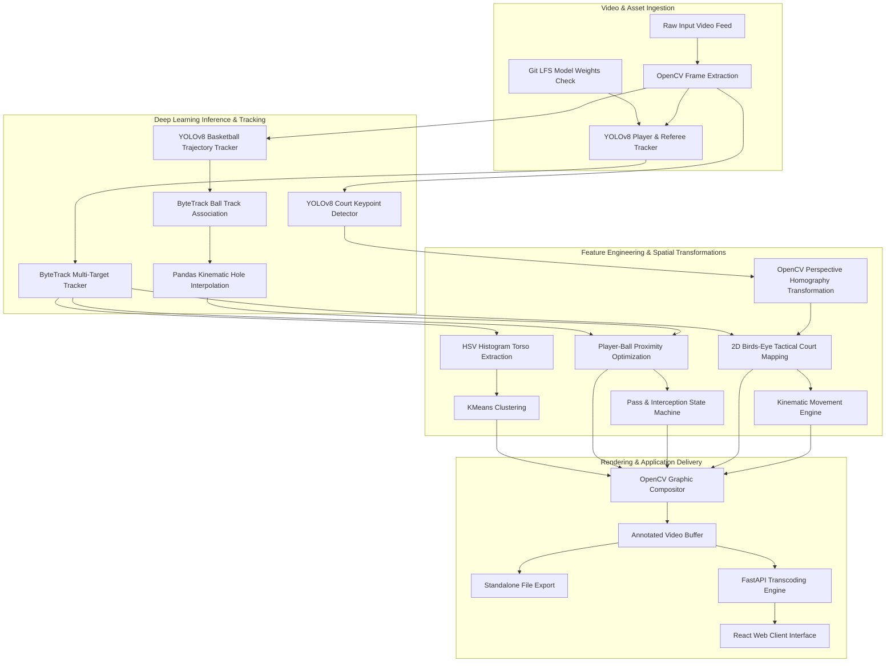

# CourtVision

A sports video analytics suite that transforms broadcast basketball footage into tactical insights using YOLOv8, ByteTrack, and spatial homography.

[](LICENSE)
[](https://www.python.org/)
[](https://fastapi.tiangolo.com/)
[](https://reactjs.org/)


*(Note: Upload UI screenshot to assets/dashboard_preview.png)*

## Features

* **Deep Learning Inference**: YOLOv8 object detection for players, referees, basketballs, and court keypoints.
* **Multi-Target Tracking**: ByteTrack implementation for consistent cross-frame tracking and trajectory association.
* **Spatial Perspective Mapping**: OpenCV homography transformations project 2D camera coordinates onto a standardized tactical minimap.
* **Kinematic Analytics**: Calculates frame-by-frame velocity and cumulative spatial distance for players.
* **Unsupervised Team Classification**: K-Means clustering in HSV color space separates opposing teams and referees.
* **Full-Stack Application**: FastAPI backend with a Vite/React frontend for real-time video upload and metrics review.

### Work in Progress
* **Player Tracking & Roster**: Improving bounding-box accuracy and geometric polygon filtering to ensure the roster UI excludes bench players and crowds.
* **Score Tracking**: Refining Tesseract OCR robustness for scoreboard graphic overlays to detect scoring events.
* **Team Assignment**: Tuning HSV color space masking to dynamically ignore court reflections and shadows during jersey clustering.
* **Tactical Minimap Extraction**: Rendering the birds-eye homography view into a standalone H.264 video feed for the UI.

## Installation

> **Hardware Recommendation:** Due to the intensive nature of running multiple YOLOv8 models concurrently, executing this pipeline on a dedicated GPU (NVIDIA CUDA or Apple Silicon MPS) is strongly recommended for reasonable processing times.

### 1. Repository Setup

Git Large File Storage (LFS) is required for PyTorch model weights.

```bash
git lfs install
git clone https://github.com/adoniasketema/CourtVision.git
cd CourtVision
git lfs pull
```

### 2. Backend Environment

```bash
python3 -m venv .venv
source .venv/bin/activate
pip install --upgrade pip
pip install -r requirements.txt
```

### 3. Frontend Environment

```bash
cd courtvision-ui
npm install
```

## Usage

### Standalone CLI Execution

Process video directly from the terminal. Output is saved to `output_videos/`.

```bash
python main.py
```

### Web Application

Start the FastAPI backend service:

```bash
source .venv/bin/activate
uvicorn api:app --reload --host 0.0.0.0 --port 8000
```

Start the React frontend development server:

```bash
cd courtvision-ui
npm run dev
```

Navigate to `http://localhost:5173` to access the application interface.

## System Architecture



## Advanced Algorithms

### Spatial Court Homography
CourtVision utilizes a YOLOv8 Court Keypoint model to locate fixed boundary landmarks. Using corresponding source pixel coordinates and real-world geometric court templates, an OpenCV homography transformation matrix normalizes dynamic player bounding box centers into a real-time 2D tactical minimap. This enables exact kinematic velocity calculation and cumulative player exertion metrics.

### Intelligent Ball Possession
A three-stage possession attribution pipeline manages motion blur and player occlusion. Sparse YOLO ball detections are ingested into Pandas DataFrames for bidirectional fill and cubic smoothing. A Euclidean positional minimization algorithm assigns ball control to the closest valid player. Finally, a state machine filters out high-frequency contact noise to classify completed passes and interceptions.

### Unsupervised Team Classification
Bounding box vertical profiles are sliced between 25% and 75% height boundaries to isolate player torsos. RGB images are converted to HSV color space, low-saturation shadow masks are stripped, and a normalized 24-bin histogram is computed. These embeddings are fed into a Scikit-Learn KMeans algorithm to classify tracker IDs into distinct teams and referees.

## License

MIT License
